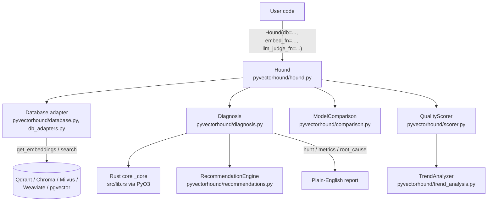

# PyVectorHound Architecture

This document describes the real, current structure of this codebase — not
an aspirational design. If something below looks unimplemented or
unverified, it's stated as such rather than glossed over. See
[ROADMAP_HONEST.md](../ROADMAP_HONEST.md) for the full status/gap list.

## What this is

PyVectorHound is a diagnostic layer for RAG/vector-search pipelines: given
retrieval results (from your own code, or fetched live from a vector DB
adapter), it computes real metrics — embedding isotropy/coverage/
distinctiveness, precision/recall/MRR against ground truth, and optional
LLM-as-judge faithfulness — and turns them into a root-cause explanation
and ranked recommendations. It does not run an embedding model, reranker,
or BM25 index itself.

## High-level flow

## Rust core (`src/`, ~1,100 lines, PyO3 extension module `pyvectorhound._core`)

| File | Real content |
|---|---|
| `src/lib.rs` (196 lines) | `#[pymodule] fn _core(...)` — the actual PyO3 entry point. Wraps the functions below as `#[pyfunction]`s: `py_compute_isotropy`, `py_compute_coverage`, `py_compute_distinctiveness`, `py_detect_drift`, `py_compute_retrieval_metrics`, `py_compute_quality_score`, `py_quantize_vector`/`py_dequantize_vector`/`py_quantize_batch`/`py_dequantize_batch`. |
| `src/metrics.rs` (329 lines) | Embedding-space diagnostics: isotropy, coverage, distinctiveness, drift detection, retrieval metrics (precision/recall/MRR), quality score. Has its own `#[cfg(test)]` unit tests. |
| `src/quantization.rs` (300 lines) | Real int8 scalar quantization: per-vector min/max linear mapping to `i8` plus a `(scale, offset)` pair for dequantization. Measured max reconstruction error ~0.0039 on a 384-dim test vector vs. the theoretical 8-bit bound (~0.0078). This is **scalar** quantization, not product quantization, and is **not** SIMD/GPU accelerated — both are out of scope, not oversights. |
| `src/retrieval_ranking.rs` (280 lines) | `RetrievalRanker`: combines BM25, semantic, recency, and diversity signals into one ranking, plus cross-encoder-style reranking. Compiled into `_core` but **not yet exposed as a callable from Python** — `lib.rs` doesn't wrap it in a `#[pyfunction]`/register it in the `#[pymodule]` block. Treat it as internal, in-progress infrastructure, not a public API. |

Validated 2026-09-20: `cargo build --release --all-features`,
`cargo test --release --all-features` (17/17 pass), `cargo fmt --check`
(clean), and `cargo clippy --release --all-features` (no warnings) all
pass on this checkout.

## Python layer (`pyvectorhound/`, ~9,800 lines across ~30 modules)

Core diagnostic path (imported by `pyvectorhound/__init__.py`, has test
coverage):

- `hound.py` — `Hound`, the main entry point. Owns the adapter, `embed_fn`,
  `llm_judge_fn`, and orchestrates `diagnose()` / `diagnose_batch()` /
  `compare_models()` / `compare_metrics()` / `detect_drift()`.
- `diagnosis.py` — `Diagnosis`: computes per-component metrics, faithfulness
  (if `llm_judge_fn` + `document_texts` given), root cause, and
  recommendations. Reports `"UNKNOWN"` for BM25/reranker (not implemented)
  instead of fabricating a score.
- `database.py` / `db_adapters.py` — `VectorDB` adapter protocol and real
  adapters for Qdrant, Chroma, Milvus, Weaviate, and pgvector.
- `comparison.py` — `ModelComparison`: `pareto_frontier()`, `ab_test()`.
- `scorer.py` — `QualityScorer`: `corpus_health()`, `detect_anomalies()`,
  dynamic GOOD/MODERATE/WEAK thresholds calibrated against
  `trend_analysis.py`'s `TrendAnalyzer` when one has been tracked.
- `trend_analysis.py` — `TrendAnalyzer`, `TimeSeries`, drift/regression/
  anomaly detection over tracked metric history.
- `recommendations.py` — `RecommendationEngine`, ranked fix suggestions.
- `retrieval_tracing.py` / `retrieval_replay.py` — capture and replay a
  retrieval pipeline's execution for debugging.
- `benchmarking.py` / `advanced_analytics.py` — latency/cost/storage
  benchmarking and cross-database comparison.
- `langchain_integration.py` / `llamaindex_integration.py` — callback/
  retriever wrappers for those frameworks.
- `okf_diagnostics.py` — a real, tested (`tests/test_okf_diagnostics.py`,
  18+ test cases) frontmatter-based persistent knowledge base for
  diagnostic findings: pattern extraction, similar-failure lookup,
  strategy-success-rate tracking. See `OKF_INTEGRATION.md`.
- `_retry.py` — exponential backoff + jitter for `embed_fn`/`llm_judge_fn`
  calls used by `diagnose_batch()`.

Present in the package but **not wired into the main import path, not
tested, and with dependencies that aren't declared in `pyproject.toml`**
(see ROADMAP_HONEST.md for the full list):

- `server.py` — a `Flask`-based REST API wrapper (`Flask` is not a declared
  dependency anywhere in `pyproject.toml`). Zero tests, zero references
  from `examples/` or `README.md`.
- `web_dashboard.py` — an HTML dashboard whose docstring/footer says
  "Powered by FastAPI" (`FastAPI` is likewise not a declared dependency).
  Zero tests, zero references elsewhere in the repo.
- `cli.py` — has a real `main()`/argparse CLI, but there is no
  `[project.scripts]` entry in `pyproject.toml`, so `pip install
  pyvectorhound` does not give you a `pyvectorhound` command. It's only
  reachable via `python -m pyvectorhound.cli`, which isn't documented
  anywhere in README/USER_GUIDE.
- `_mcp_connector.py` / `_mcp_tools.py` / `server.py`'s MCP hooks — support
  an optional integration with a separate `statguardian` package via
  `try: from statguardian._mcp_connector import BaseMCPConnector except
  ImportError: <local fallback class>`. `statguardian` is not a dependency
  of this project and this path is untested here.

## Testing

`tests/` (10 files, 174 tests as of 2026-09-20, all passing) covers the
core diagnostic path: `hound.py`, `diagnosis.py`, `scorer.py`,
`benchmarking.py`, `trend_analysis.py`, `recommendations.py`,
`okf_diagnostics.py`, database adapters (via mocks), and the LangChain/
LlamaIndex/OTel/advanced-analytics integrations
(`test_v05_integrations.py`). There are no tests for `server.py`,
`web_dashboard.py`, `validation.py`, or `cli.py`.

`pytest --cov=pyvectorhound` only reports real numbers with an editable
install (`pip install -e ".[dev]"`, what CI uses — 56% overall as of this
audit); a plain non-editable install makes every module read 0% because
`coverage.py` can't map the installed `site-packages` copy back to this
source tree. With the correct (editable) install, `server.py`,
`web_dashboard.py`, and `validation.py` genuinely show 0% — they're
real gaps, not a measurement artifact. See ROADMAP_HONEST.md.
